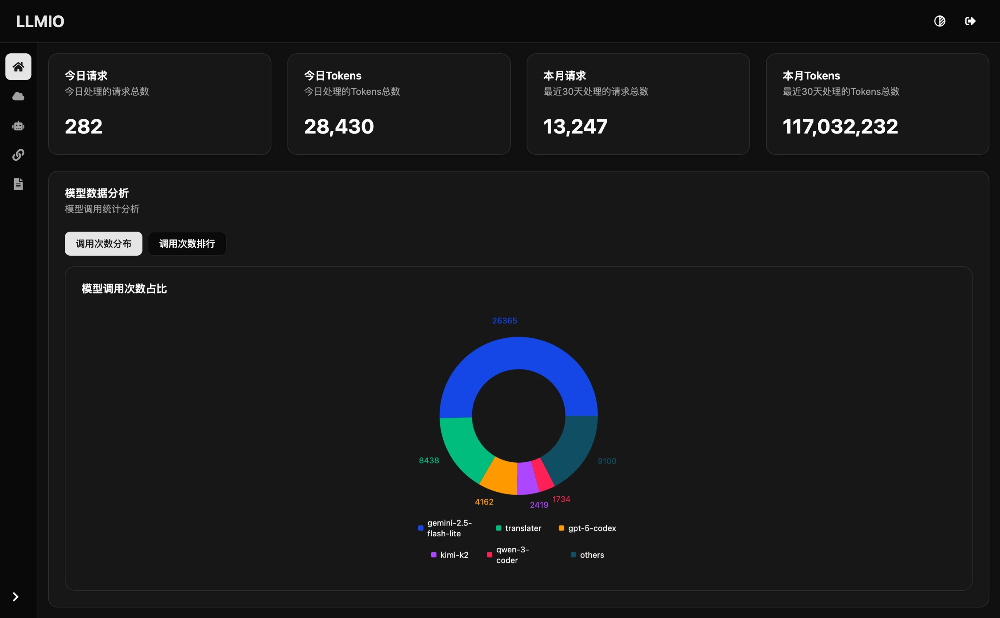
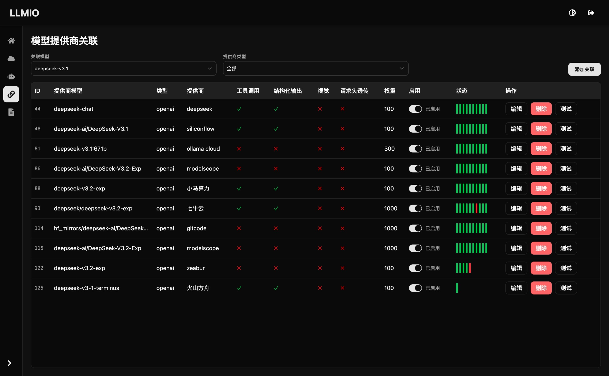
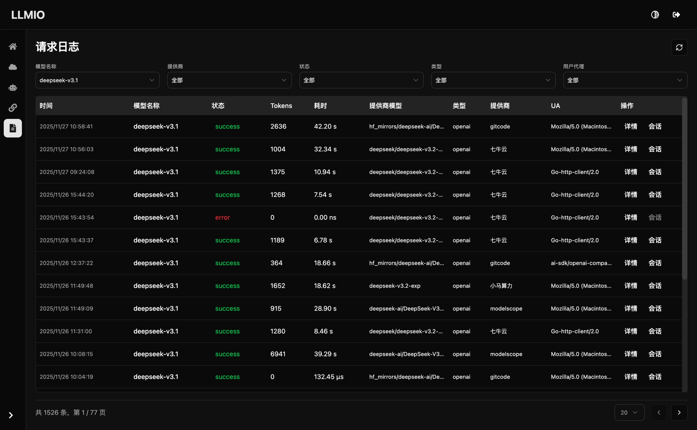

# LLMIO

LLMIO 是一个基于 Go 的多供应商大语言模型网关，提供统一的 REST API、权重调度与现代化管理界面，帮助你在一个服务中整合 OpenAI、Anthropic 等不同模型能力。

## 架构图


## 功能特性
- **统一 API**：兼容 OpenAI Chat Completions、OpenAI Responses 与 Anthropic Messages 语义，支持流式与非流式响应。
- **权重调度**：`balancers/` 提供多种调度策略，可按工具调用、结构化输出、多模态能力与权重做智能分发。
- **可视化管理后台**：Web UI（React + TypeScript + Tailwind + Vite）覆盖提供商、模型、关联、日志与指标。
- **速率与失败处理**：内建速率限制兜底与提供商连通性检测，保证故障隔离。
- **本地持久化**：通过 SQLite (`db/llmio.db`) 保存配置和调用记录，开箱即用。

## 部署
**llmio通过读取环境变量的TOKEN来配置控制台以及所有API接口的鉴权！**
### Docker Compose (推荐)
```yaml
services:
  llmio:
    image: atopos31/llmio:latest
    ports:
      - 7070:7070
    volumes:
      - ./db:/app/db
    environment:
      - GIN_MODE=release
      - TOKEN=<YOUR_TOKEN>
      - TZ=Asia/Shanghai
```
```bash
docker compose up -d
```

### Docker
```bash
docker run -d \
  --name llmio \
  -p 7070:7070 \
  -v $(pwd)/db:/app/db \
  -e GIN_MODE=release \
  -e TOKEN=<YOUR_TOKEN> \
  -e TZ=Asia/Shanghai \
  atopos31/llmio:latest
```

### 本地运行
前往 [releases](https://github.com/atopos31/llmio/releases) 下载对应操作系统及cpu架构的压缩包(版本大于0.5.13)，这里以 linux amd64 为例。
```bash
wget https://github.com/atopos31/llmio/releases/download/v0.5.13/llmio_0.5.13_linux_amd64.tar.gz
```
解压
```bash
tar -xzf ./llmio_0.5.13_linux_amd64.tar.gz
```
启动
```bash
GIN_MODE=release TOKEN=<YOUR_TOKEN> ./llmio
```
运行后会自动在当前目录下创建 `./db/llmio.db` 作为 `sqlite` 持久化数据文件。

## 开发

克隆项目
   ```bash
   git clone https://github.com/atopos31/llmio.git
   cd llmio
   ```
编译前端(需要 pnpm 环境)
   ```bash
   make webui
   ```
运行后端(需要 go 版本 > 1.25.0)
   ```bash
   TOKEN=<YOUR_TOKEN> make run
   ```
访问入口webui：`http://localhost:7070/`

## API 端点

LLMIO 提供多供应商兼容的 REST API，支持以下端点：

| 供应商 | 端点路径 | 方法 | 功能 | 认证方式 |
|--------|----------|------|------|----------|
| OpenAI | `/openai/v1/models` | GET | 获取可用模型列表 | Bearer Token |
| OpenAI | `/openai/v1/chat/completions` | POST | 创建聊天完成 | Bearer Token |
| OpenAI | `/openai/v1/responses` | POST | 创建响应 | Bearer Token |
| Anthropic | `/anthropic/v1/models` | GET | 获取可用模型列表 | x-api-key |
| Anthropic | `/anthropic/v1/messages` | POST | 创建消息 | x-api-key |
| Anthropic | `/anthropic/v1/messages/count_tokens` | POST | 计算Token数量 | x-api-key |
| 通用 | `/v1/models` | GET | 获取模型列表（兼容） | Bearer Token |
| 通用 | `/v1/chat/completions` | POST | 创建聊天完成（兼容） | Bearer Token |
| 通用 | `/v1/responses` | POST | 创建响应（兼容） | Bearer Token |
| 通用 | `/v1/messages` | POST | 创建消息（兼容） | x-api-key |
| 通用 | `/v1/messages/count_tokens` | POST | 计算Token数量（兼容） | x-api-key |

### 认证方式

LLMIO 根据端点类型使用不同的认证方式：

#### 1. OpenAI 格式端点（Bearer Token）
适用于：`/openai/v1/*` 和 `/v1/*` 中的 OpenAI 兼容端点
```bash
curl -H "Authorization: Bearer YOUR_TOKEN" http://localhost:7070/openai/v1/models
```

#### 2. Anthropic 格式端点（x-api-key）
适用于：`/anthropic/v1/*` 和 `/v1/*` 中的 Anthropic 兼容端点
```bash
curl -H "x-api-key: YOUR_TOKEN" http://localhost:7070/anthropic/v1/messages
```

对于cc或者codex, 使用如下环境变量接入鉴权
```bash
export OPENAI_API_KEY=<YOUR_TOKEN>
export ANTHROPIC_API_KEY=<YOUR_TOKEN>
```
> **注意**：`/v1/*` 路径为兼容性保留，建议使用新的供应商特定路径。

## 目录结构

```
.
├─ main.go              # HTTP 服务入口与路由注册
├─ handler/             # REST 接口层
├─ service/             # 业务逻辑与负载均衡调用
├─ middleware/          # 鉴权、速率限制与流式响应中间件
├─ providers/           # 多模型供应商适配实现
├─ balancers/           # 权重与调度策略
├─ models/              # GORM 实体定义与数据库初始化
├─ common/              # 通用工具与响应辅助方法
├─ webui/               # React + TypeScript 管理前端
└─ docs/                # 运维与使用说明
```

## 截图







## 许可证

本项目基于 MIT License 发布。

## 星标历史

[](https://starchart.cc/atopos31/llmio)