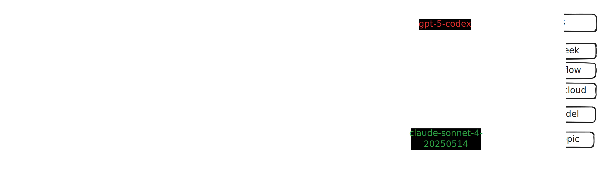
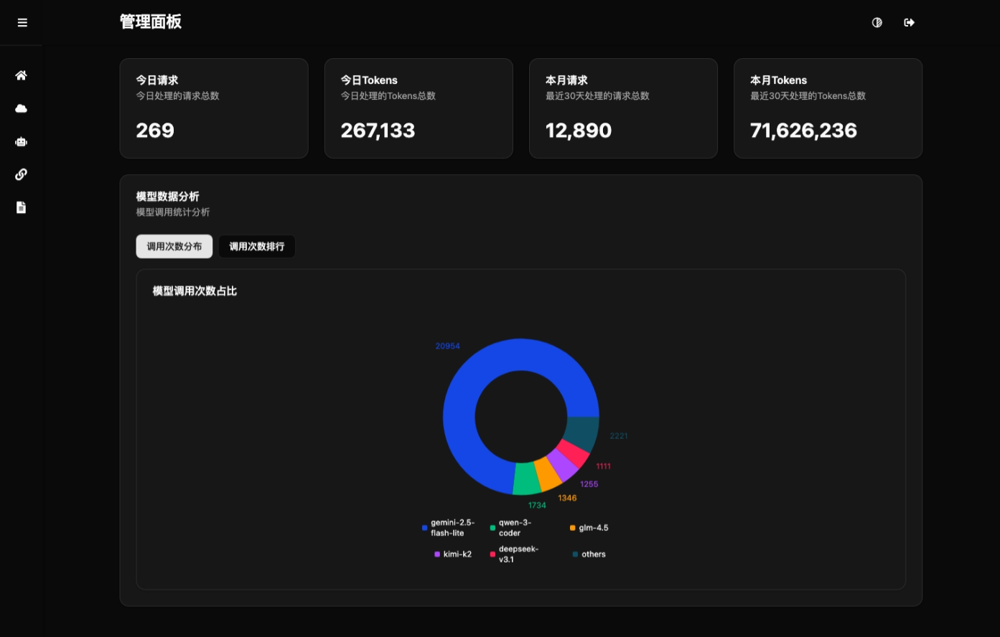
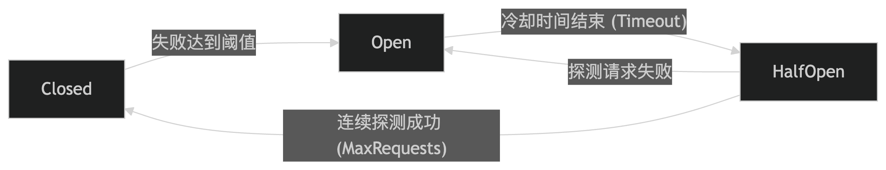

# LLMIO

LLMIO 是一个基于 Go 的多供应商大语言模型网关，提供统一的 REST API、权重调度与现代化管理界面，帮助你在一个服务中整合 OpenAI、Anthropic 等不同模型能力。

## 架构图



## 功能特性
- **统一 API**：兼容 OpenAI Chat Completions、OpenAI Responses 与 Anthropic Messages 语义，支持流式与非流式响应。
- **权重调度**：`balancer/` 提供多种调度策略，可按工具调用、结构化输出、多模态能力与权重做智能分发。
- **可视化管理后台**：Web UI（React + TypeScript + Tailwind + Vite）覆盖提供商、模型、关联、日志与指标。
- **速率与失败处理**：内建速率限制兜底与提供商连通性检测，保证故障隔离。
- **本地持久化**：通过 SQLite (`db/llmio.db`) 保存配置和调用记录，开箱即用。

## 部署

### Docker
```bash
docker build -t llmio .
docker run -p 7070:7070 -e TOKEN=your-token llmio
```

### Docker Compose
```yaml
services:
  llmio:
    image: atopos31/llmio:latest
    ports:
      - 7070:7070
    volumes:
      - ./db:/app/db
    environment:
      - GIN_MODE=release
      - TOKEN=<YOUR_TOKEN>
      - TZ=Asia/Shanghai
```
```bash
docker compose up -d
```

## 快速开始

1. **克隆项目**
   ```bash
   git clone https://github.com/atopos31/llmio.git
   cd llmio
   ```
2. **本地快速启动**（推荐）
   ```bash
   make run
   ```
   `make run` 会自动执行 `go fmt`、`go mod tidy` 并启动后端服务。首次启动会在 `db/` 目录生成 SQLite 数据库。
3. **访问入口**
   - 管理界面：`http://localhost:7070/`
   - OpenAI 兼容接口：`http://localhost:7070/v1/chat/completions`
   - Anthropic 兼容接口：`http://localhost:7070/v1/messages`

> 提示：如需开启鉴权，设置环境变量 `TOKEN=your-token`，随后在管理端或 API 请求头中加入 `Authorization: Bearer your-token`。

## 开发环境准备

### 先决条件
- Go 1.25+
- Node.js 20+
- pnpm 9+（`npm install -g pnpm`）

### 后端开发
```bash
go run main.go        # 启动 REST API 与静态资源托管
go test ./...         # 运行所有 Go 单元测试（提交前务必通过）
```

### 前端开发
```bash
cd webui
pnpm install          # 安装前端依赖
pnpm run dev          # 启动 Vite 开发服务器（默认 http://localhost:5173）
pnpm run build        # 产出静态资源，构建结果托管于 Go 服务
pnpm run lint         # 执行 ESLint + TypeScript 校验
```

## 配置与数据

- **环境变量**
  - `TOKEN`：可选，开启管理端与管理 API 的 Bearer Token 鉴权。
  - `TZ`：可选，指定时区（默认 UTC）。
- **数据库**：SQLite 文件存放于 `db/llmio.db`，模型、提供商、关联与日志均保存在此。
- **模型与提供商**：可通过 Web UI 配置，也可直接写入数据库。示例：
  - OpenAI Chat 提供商（`type=openai`）：`{"base_url": "https://api.openai.com/v1", "api_key": "your-api-key"}`
  - OpenAI Responses 提供商（`type=openai-res`）：`{"base_url": "https://api.openai.com/v1", "api_key": "your-api-key"}`，请求将发送至 `/responses` 端点。
  - Anthropic 提供商（`type=anthropic`）：`{"base_url": "https://api.anthropic.com/v1", "api_key": "your-api-key", "version": "2023-06-01"}`

## API 概览

- `POST /v1/chat/completions`：兼容 OpenAI Chat Completions，请求体遵循官方格式，支持 `stream`。
- `POST /v1/messages`：兼容 Anthropic Messages，用于 Claude 调用。
- `POST /v1/responses`：转发至 `type=openai-res` 的供应商，实现 OpenAI Responses API 适配。
- `GET /v1/models`：返回可用模型列表。
- 管理 API 位于 `/api/*`，需要 `Authorization: Bearer <TOKEN>`：
  - `/api/providers`、`/api/models`、`/api/model-providers` 支持 CRUD。
  - `/api/logs`、`/api/metrics/use/:days`、`/api/metrics/counts` 提供日志与统计。

## Web 管理界面

管理后台支持系统概览、提供商与模型管理、权重关联、请求日志、连通性测试等。运行后访问 `http://localhost:7070/` 即可使用。

## 目录结构

```
.
├─ main.go              # HTTP 服务入口与路由注册
├─ handler/             # REST 接口层
├─ service/             # 业务逻辑与负载均衡调用
├─ middleware/          # 鉴权、速率限制与流式响应中间件
├─ providers/           # 多模型供应商适配实现
├─ balancer/            # 权重与调度策略
├─ models/              # GORM 实体定义与数据库初始化
├─ common/              # 通用工具与响应辅助方法
├─ webui/               # React + TypeScript 管理前端
└─ docs/                # 运维与使用说明
```

## 截图





## 贡献指南

欢迎通过 Issue 或 Pull Request 贡献代码。提交前请确保：
- `go test ./...`、`pnpm run lint` 通过。
- 代码经过 `go fmt`，提交信息遵循 Conventional Commits（例如 `feat: ...`、`fix(handler): ...`）。
- 未包含敏感凭证，可通过环境变量或未纳管的 `.env` 管理。

## 许可证

本项目基于 MIT License 发布。
