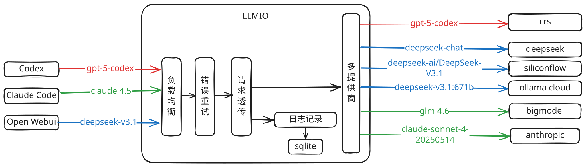
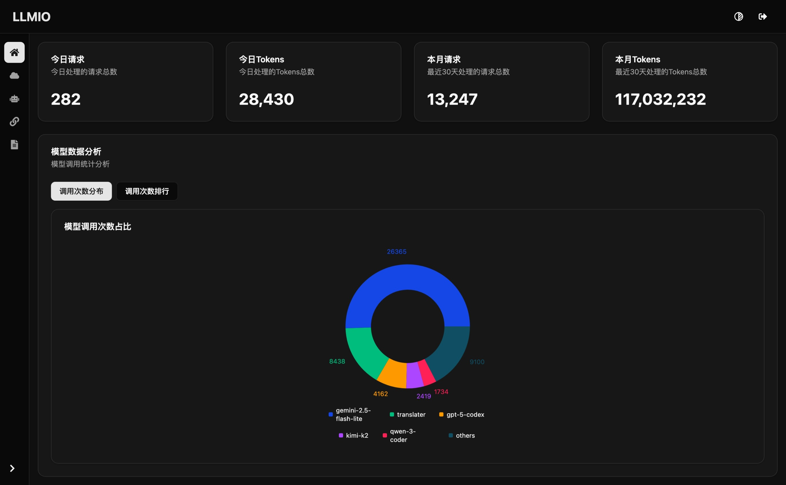
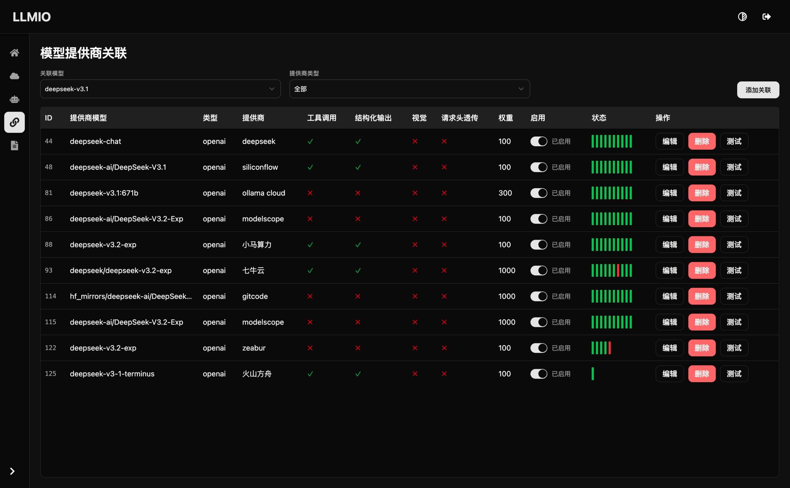
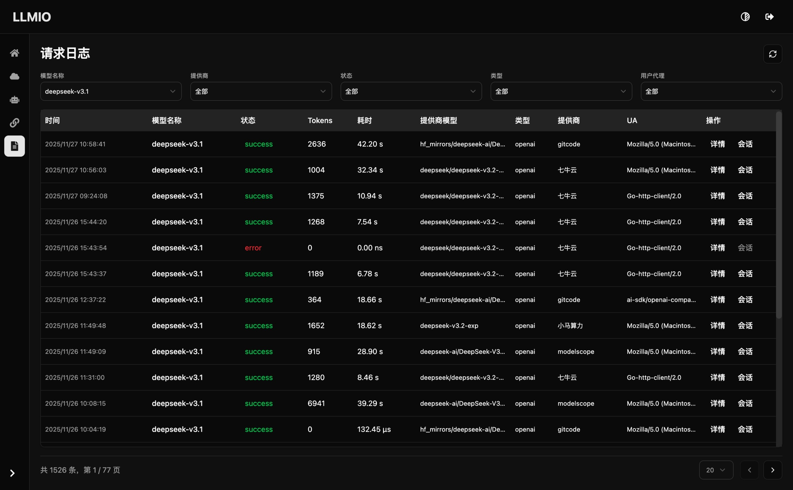
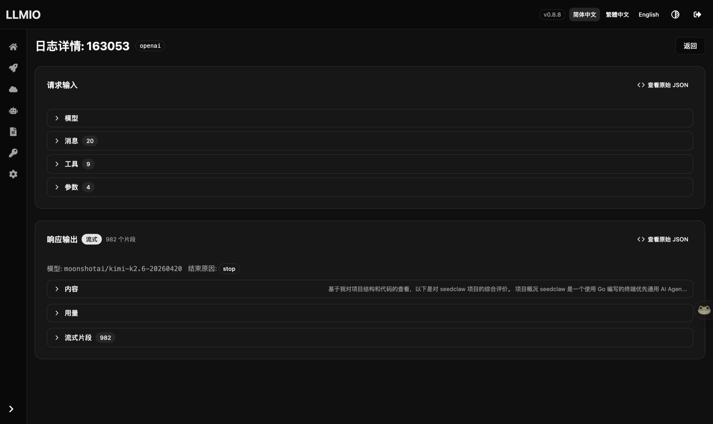

# LLMIO

English | [中文](README_cn.md)

LLMIO is a Go-based LLM load‑balancing gateway that provides a unified REST API, weighted scheduling, observability, and a modern admin UI for LLM clients (openclaw / claude code / codex / gemini cli / cherry studio / open webui). It helps you integrate OpenAI, Anthropic, Gemini, and other model capabilities in a single service.

**QQ group: 1083599685**

## Architecture



## Features
- **Unified API**: Compatible with OpenAI Chat Completions, OpenAI Responses, Gemini Native, and Anthropic Messages. Supports both streaming and non‑streaming passthrough.
- **Protocol bridge**: When the client protocol differs from the upstream protocol, requests are translated automatically (OpenAI ⇄ Anthropic, streaming events included). Anything that cannot be carried across is either rejected outright (the router moves on) or recorded field by field — never dropped silently. See [Protocol Bridge](#protocol-bridge).
- **Custom headers & session keys**: Each model–provider association can carry headers with `{{...}}` placeholders, and a session key is derived in stages from the request body, an inbound session header or a conversation root hash, always non-empty — so upstreams that require a session header (opencode, for example) work out of the box. See [Custom Headers & Session Keys](#custom-headers--session-keys).
- **Weighted scheduling**: `balancers/` provides two strategies (random by weight / priority by weight). You can route based on tool calling, structured output, and multimodal capability.
- **Admin Web UI**: React + TypeScript + Tailwind + Vite console covering the dashboard, analytics, quick start, providers, model routing, request logs, session comparison, quota, auth keys, and system configuration.
- **Quota & balance**: Normalizes the many different usage / balance APIs of upstreams into one structure, with three kinds of data source: built-in adapters, HTTP, and sandboxed JavaScript. See [Quota & Balance](#quota--balance).
- **Time-of-day pricing**: Multipliers for the input / cache-read / output prices by period, configured per model–provider association, with one global workday calendar and holiday syncing. See [Time-of-Day Pricing](#time-of-day-pricing).
- **Usage analytics**: Five views — time series, multi-dimensional breakdown, latency distribution, error grouping and model performance — with a custom time range and multi-value filters. See [Usage Analytics](#usage-analytics).
- **Request logs & session comparison**: Multi-select filters on the log page, full request / response inspection per entry, and a comparison page that analyzes up to 6 logs at once in the order a cache actually builds a prefix.
- **Access keys**: Issue a separate key per client, each with its own enable / disable state, expiry, model allow-list and whether request bodies are recorded. Usage count and last-used time are tracked per key, and both the log and analytics pages can filter by it.
- **Log retention**: The Settings page sets the retention window and the scheduled-cleanup switch (checked hourly in the background); the log page also offers a manual cleanup, and past runs are listed in a cleanup history.
- **Rate limiting & failure handling**: Built‑in rate‑limit fallback, a per-model circuit breaker, and provider connectivity checks for fault isolation.
- **Local persistence**: Pure Go SQLite (`db/llmio.db`) for config and request logs, ready to use out of the box.
- **Database compression & space reclamation**: Request bodies are content-defined chunked and globally deduplicated; historical rows can be migrated in place, paused, resumed, and rolled back. Freed space can be returned to the filesystem while the service keeps running, and a large hole can be reclaimed in one pass with a full rebuild (which needs an offline window and about twice the database size on disk). Measured on a copy of a production database: 7.06 GiB → 1.47 GiB. See [Database Compression & Space Reclamation](#database-compression--space-reclamation).
- **Session tracking**: Pass `session_id` in any request body (works with `extra_body` in OpenAI SDK) to tag logs with a session identifier. Filter and search by `session_id` in the admin UI or via `GET /api/logs?session_id=`.
- **Observability**: Every request is recorded with TraceID, latency breakdown (proxy / first-chunk / completion time), TPS, token usage (input / cached / output), and optional full IO logging. Per-request cost is calculated from configurable per-million-token prices (CNY / USD) and shown in the log detail view alongside provider and model metadata.

## Deployment

### Docker Compose (Recommended)
```yaml
services:
  llmio:
    image: atopos31/llmio:latest
    ports:
      - 7070:7070
    volumes:
      - ./db:/app/db
    environment:
      - GIN_MODE=release
      - TOKEN=<YOUR_TOKEN>
      - TZ=Asia/Shanghai
```
```bash
docker compose up -d
```

### Docker
```bash
docker run -d \
  --name llmio \
  -p 7070:7070 \
  -v $(pwd)/db:/app/db \
  -e GIN_MODE=release \
  -e TOKEN=<YOUR_TOKEN> \
  -e TZ=Asia/Shanghai \
  atopos31/llmio:latest
```

### Local Run
Download the release package for your OS/arch from [releases](https://github.com/atopos31/llmio/releases) (version > 0.5.13). Example for linux amd64:
```bash
wget https://github.com/atopos31/llmio/releases/download/v0.5.13/llmio_0.5.13_linux_amd64.tar.gz
```
Extract:
```bash
tar -xzf ./llmio_0.5.13_linux_amd64.tar.gz
```
Start:
```bash
GIN_MODE=release TOKEN=<YOUR_TOKEN> ./llmio
```
The service will create `./db/llmio.db` in the current directory as the SQLite persistence file.

## Environment Variables

| Variable | Description | Default | Notes |
|---|---|---|---|
| `TOKEN` | Console login and API auth for `/openai` `/anthropic` `/gemini` `/v1` | None | Required for public access |
| `GIN_MODE` | Gin runtime mode | `debug` | Use `release` in production |
| `LLMIO_SERVER_PORT` | Server listen port | `7070` | Service listen port |
| `TZ` | Timezone for logs and scheduling | Host default | Recommend explicit setting in containers (e.g. `Asia/Shanghai`) |
| `DB_COMPRESS` | Store newly written request bodies in compressed form | `true` | Setting it to `false` affects new rows only; previously compressed rows remain readable |
| `DB_VACUUM` | Run SQLite VACUUM once on startup | Disabled | Set to `true` to enable. VACUUM takes an exclusive write lock and needs free disk of about 2× the database size |
| `DB_AUTO_VACUUM_REBUILD` | Rebuild an existing database on startup to enable incremental space reclamation | `auto` | `auto` sets `auto_vacuum` on empty databases only; `on` converts an existing database with a single VACUUM (minutes, exclusive write lock, 2× disk required); `off` never modifies it. Any other value is treated as `auto` |
| `LLMIO_QUOTA_CONFIG` | Path of the quota configuration file | `./db/quota.config.json` | Changes only the file location; its contents (credentials included) are read and written by the console and never stored in the database |
| `LLMIO_QUOTA_ALLOW_WRITE` | Whether quota write endpoints are enabled | Writes allowed | Only the exact value `false` (case-sensitive) switches to read-only mode, where every write endpoint under `/api/quota` returns 403; test runs change no state and are unaffected |

> For the full description, console entry point and admin endpoints, see [Database Compression & Space Reclamation](#database-compression--space-reclamation).

## Protocol Bridge

When the client protocol and the upstream protocol differ, the gateway inserts a translation layer between
them; when both ends speak the same protocol the request is forwarded unchanged and never enters that layer.

- **The direction is determined automatically**: it follows the client protocol and the upstream type
  actually selected for that attempt, and is re-evaluated for each candidate. The candidate pool is built
  from the client protocol: an OpenAI client may use `openai` / `openai-res` / `anthropic` upstreams, an
  Anthropic client `anthropic` / `openai`; Gemini and OpenAI Responses upstreams never take part.
- **Prefer the same protocol**: the per-model "Prefer the same protocol" switch (on by default) decides
  whether both protocols join the same draw. When it is on, upstreams speaking the client protocol are used
  whenever the model has any, and translation is only a fallback for models without one; when it is off, the
  whole pool is drawn by weight.
- **What is translated**: request bodies, non-streaming responses and streaming events — Anthropic's
  `message_start` / `content_block_*` / `message_delta` / `message_stop` and OpenAI's chunk sequence can be
  produced and consumed in either direction, including tool calls, stop reasons and token-usage accounting.
- **What cannot be carried over is never dropped silently**: when the request as a whole cannot be
  expressed it is **rejected** and the router moves on to the next provider; when only individual fields are
  lost they are **recorded** as short codes in the request log. Rejection covers `n>1`, structured output,
  non-zero penalties and logprobs; recording covers `top_k`, `thinking` and `reasoning_content`.
- **Where to look**: when the upstream protocol differs from the client's, the log detail view shows an
  "Upstream Protocol" field and a "Protocol Bridge" section that translates each short code into a sentence;
  the backend also emits one `protocol bridged` warning.

A cross-protocol upstream request gets `max_tokens` defaulted to 8192 (required on the Anthropic side, and
recorded as `defaulted_max_tokens` when the client did not provide it). The complete field-by-field mapping,
the trade-off behind that default and the streaming state machine are in
[docs/protocol-bridge.md](docs/protocol-bridge.md); the end-to-end acceptance run is `e2e/run_matrix.py`.

## Custom Headers & Session Keys

- **Custom headers**: each model–provider association can carry request headers whose values support `{{...}}`
  placeholders. A value without `{{` is sent literally (existing configurations keep their behaviour); one
  with placeholders is evaluated per request. Available placeholders are `{{session}}`, `{{session_id}}`,
  `{{model}}`, `{{provider_model}}`, `{{trace_id}}`, `{{auth_key_id}}` and `{{uuid}}`. Unrecognised
  placeholders are left as they are, so a typo shows up instead of silently losing a value. An empty result
  is replaced by a random string, so a configured header always carries a non-empty value.
- **Session key derivation**: `{{session}}` is resolved by priority and is always non-empty — request-body
  `session_id` → inbound session header (`x-opencode-session` / `x-session-id` / `session_id`) → conversation
  root hash → random string. The root hash fingerprints the first user message in the body, so with no
  cooperation from the client every turn of the same conversation still gets the same value, while different
  conversations get different ones.
- **Why it is needed**: some upstreams (opencode, for example) require a session header on every request and
  return 400 when it is missing or empty; hardcoding one value collapses every client and every conversation
  on that upstream into a single session, causing context bleed and cache overwrites.
- **Header precedence**: provider configuration > custom headers > passthrough client headers. The
  passthrough switch decides whether the client's original headers are carried over; either way auth headers
  and `Accept-Encoding` are removed — the former so credentials never leak, the latter because Go's transport
  must negotiate it itself or the response will not be transparently decompressed.

## Database Compression & Space Reclamation

Almost all of the request-log volume comes from three body columns of the `chat_ios` table (`input`,
`of_string`, `of_string_array`). Coding clients resend the entire conversation history on every turn, so
the request body of round N contains the request body of round N−1 almost byte for byte, and the same
passage reappears hundreds of times across rounds. Row-wise compression cannot exploit this (each row is
an independent compression window), and whole-row hashing does not hit either (byte-identical rows are
less than 1% of the table). The effective approach is **content-defined chunking followed by global
deduplication**: identical content is stored once.

### Migration: rewriting historical bodies into compressed form

- **Chunking and deduplication**: Bodies are split on content-defined boundaries into chunks averaging
  4 KiB (FastCDC rolling hash); chunks with identical content are stored once, and each row keeps only its
  own sequence of chunk IDs. Chunks are packed into 256 KiB groups with one compressed frame per group;
  reads decompress by group and keep a 32 MiB group cache in memory.
- **Row-wise frames**: The `of_string` and `of_string_array` columns do not use the chunk table; they are
  stored as row-wise compressed frames.
- **Lossless**: Chunk contents plus each row's chunk-ID sequence reconstruct the original bytes exactly.
  A frame starts with a 16-byte self-describing header (magic, version, codec, raw length), and plain text
  and frames may be mixed in the same column. The read path trusts only the header and falls back to
  plain text whenever the answer is uncertain: a valid JSON body can never begin with `0x00`, which is the
  first byte of the frame magic.
- **How migration runs**: Historical rows are rewritten **in place** and committed in batches (64 rows /
  32 MiB by default, one transaction per batch). The service stays up throughout: reads are unaffected and
  a write request waits at most one batch. Migration can be paused at any time; after an interruption
  (process killed, power loss) it resumes from its watermark, and already migrated rows are not processed
  twice. Newly written rows are stored compressed as soon as `DB_COMPRESS` is enabled, without waiting for
  the historical migration to finish.
- **Quiescence window**: Rows written within the last 60 seconds are skipped by default (`quiesce_sec`) so
  that rows still being written are not touched.
- **Rollback**: All compressed bodies can be restored to plain text. This resets migration progress and
  makes the database file significantly larger; returning to the compressed form then requires a full
  migration again.

### Space reclamation: returning freed pages to the filesystem

Deleting rows in SQLite only returns pages to the free list; with the default configuration
(`auto_vacuum=0`) the file never shrinks. There are two ways to give those pages back to the filesystem,
and they need different things:

- **Incremental reclamation** needs the database to be in `auto_vacuum=INCREMENTAL` (value 2). On a
  database with `auto_vacuum=0` it is a no-op, so its controls are shown **disabled** with that reason.
  - **New databases**: Set to INCREMENTAL before any table is created, at no extra cost.
  - **Existing databases**: Left **untouched** by default. To convert, set `DB_AUTO_VACUUM_REBUILD=on`; the
    service then runs a single VACUUM before it starts listening (about 1 minute for a 7 GiB database on the
    development machine). The conversion holds an exclusive write lock and needs free disk of about 2× the
    database size; if disk space is insufficient it is skipped and the reason is recorded, without
    preventing the service from starting.
  - **What a round does**: Returns free pages to the filesystem one at a time (the driver ignores the
    argument the pragma is given, so a "batch" is a number of statements inside one transaction). A batch
    starts at 64 statements and adapts between 16 and 512 to stay near 2.5 seconds — batches must follow
    the database, because the same 512 statements took 1.1 seconds on one database and 8.9 seconds on
    another, and anything past 5 seconds makes write requests fail. It does not modify data and can be
    repeated or interrupted. A single round runs for at most 90 seconds and leaves the remainder for the
    next round; in continuous mode every batch is followed by a 0.1 second pause, so write requests queue
    and slow down rather than fail. Reads are unaffected, writes are slower while it runs.
- **Full rebuild (VACUUM)**: Needs no `auto_vacuum` setting. Rewrites the whole database in one statement
  and returns every free page at once. It is much faster than incremental reclamation (measured on the same
  7 GiB database: 895 ms against a file that was almost entirely free pages, 56 seconds against 7 GiB of
  live pages — the time follows the **live data**, not the file size), but it holds the database
  exclusively for the whole run: reads and writes cannot get in, and a write request fails once its
  5-second busy timeout runs out. It needs free disk of about 2× the database size (checked before it
  starts) and **cannot be stopped once started**, because a single statement has no point at which to stop.
  Use it after the holes are large (a migration, a rollback, a bulk delete).
- **Choosing between the two**: Use VACUUM for a large amount of free space (one pass, but requires
  downtime and 2× disk); use incremental reclamation for the small holes that accumulate day to day
  (online, no extra disk, but it needs the conversion above).

### Console

The **Database Compression** card on the Settings page shows migration progress and compression ratio,
database file size and reclaimable space, and provides five actions: "Start migration", "Pause", "Revert to
plaintext", "Reclaim space", and "Vacuum now". Each of the two reclamation actions states its own cost
before it is confirmed: reclamation says write requests queue and slow down, a rebuild says reads and
writes cannot get in and write requests fail. Migration policy (background auto-advance, rows per batch,
bytes per batch, pause between batches, quiescence window) is configured under "Adjust policy", and
reclamation policy (background auto-reclaim, minimum reclaimable space, check interval) under "Reclaim
policy". The "?" next to each field label shows the accepted range and out-of-range behaviour on hover or
keyboard focus.

### Admin endpoints

| Path | Method | Description |
|---|---|---|
| `/api/logs/compression` | GET | Migration status and progress, migration policy, reclamation policy, database statistics, the last reclamation result, and which maintenance task is running right now |
| `/api/logs/compression/policy` | PUT | Set migration policy (batch size, pause between batches, quiescence window, background auto-advance) |
| `/api/logs/compression/run` | POST | Start migration |
| `/api/logs/compression/pause` | POST | Pause migration (takes effect after the current batch completes) |
| `/api/logs/compression/decompress` | GET | Query rollback progress |
| `/api/logs/compression/decompress` | POST | Roll back to plain text |
| `/api/logs/compression/reclaim` | POST | Reclaim space. Body `{"continuous": true}` reclaims until finished; an empty body runs a single round (up to 90 seconds) |
| `/api/logs/compression/reclaim/stop` | POST | Stop reclamation (takes effect after the current batch completes) |
| `/api/logs/compression/reclaim/policy` | PUT | Set reclamation policy (minimum reclaimable space, check interval) |
| `/api/logs/compression/vacuum` | POST | Rebuild the whole database (VACUUM) in the background. Rejected before it starts unless free disk is at least 2× the database size, and while another reclamation is running |

All of these require console authentication (`Authorization: Bearer <TOKEN>`). Out-of-range values are
clamped to the accepted range instead of being rejected:

| Parameter | Accepted range | Out-of-range behaviour |
|---|---|---|
| Rows per batch `batch_rows` | 1–4096 | Below 1 falls back to the default 64; above 4096 becomes 4096 |
| Bytes per batch `batch_bytes` | up to 1 GiB | Below 1 falls back to the default 32 MiB; above becomes 1 GiB |
| Pause between batches `batch_interval_ms` | 0–5000 ms | Negative values become 0 |
| Quiescence window `quiesce_sec` | 0–86400 s | Negative values become 0 |
| Minimum reclaimable space `min_bytes` | 0–1 TiB | Negative values become 0 |
| Check interval `check_interval_sec` | 60–86400 s | Below 60 becomes 60 |

### Caveats

- **Body columns must not be used for SQL text comparison.** A compressed row stores a binary frame, so
  `LIKE`, `json_extract` and similar queries against the body will not match. To read a single chat IO
  entry, use `GET /api/logs/:id/chat-io`, which transparently restores the body.
- **Migration and reclamation share one maintenance lock** and never run at the same time. Scheduled log
  cleanup skips its round while either of them is running.
- **Confirm that a usable backup exists before migrating.** `db/llmio.db.bak` is detected automatically;
  if it is missing or smaller than the current database, the console asks for confirmation and records the
  run as performed without a backup.
- `DB_COMPRESS=false` stops compression of **newly written rows** only; previously compressed rows remain
  readable.

Compression ratio and duration depend on the corpus. On a copy of a production database of 12,483 rows
(5.64 GiB of bodies) the development machine measured: 36 seconds for the migration, 7.06 GiB → 1.47 GiB
for the database file after VACUUM, and roughly 1,500 pages/second for incremental reclamation. The full
set of measurements and trade-offs is in [docs/db-compression-phase0.md](docs/db-compression-phase0.md)
(read-path baseline), [docs/db-compression-phase3.md](docs/db-compression-phase3.md) (chunk table and
deduplication), [docs/db-compression-phase4.md](docs/db-compression-phase4.md) (migration and scheduling),
[docs/db-compression-phase5.md](docs/db-compression-phase5.md) (storage layer and incremental
reclamation), [docs/db-compression-phase6.md](docs/db-compression-phase6.md) (backfilling the two response
body columns), [docs/db-compression-phase7.md](docs/db-compression-phase7.md) (rebuild, adaptive
reclamation batches, and what a rebuild costs concurrent write requests), and
[docs/db-compression-safety.md](docs/db-compression-safety.md) (frame format and safety boundaries).

## Quota & Balance

Normalizes the many different "usage / balance" APIs of upstreams into one structure: any two of used,
total and remaining derive the third, the status follows from the used percentage and the remaining value,
and the tightest item is surfaced as a page-level summary. Display text is rendered server-side.

Three kinds of data source:

- **Built-in adapters**: `deepseek` (balance), `moonshot` (balance), `scnet` (National Supercomputing Center
  TokenPlan, login-based), `opencode` (plan, login-based) and `custom` (a generic endpoint whose path you
  supply, read through `itemsPath` plus a field mapping). Login-based adapters need their credentials in the
  source's own `env` (keys `SCNET_USER` / `SCNET_PASS` and `OPENCODE_COOKIE` / `OPENCODE_ORG_ID`): those
  upstreams require a real login and session, which a script cannot reproduce, so they live in Go.
- **HTTP**: configuration only, no code — URL, method, query, headers, body and auth style
  (`bearer` / `header` / `basic` / `none`), with `{{apiKey}}`, `{{baseUrl}}`, `{{id}}` and `{{name}}`
  placeholders.
- **Script**: a piece of JavaScript (goja, ES5.1 baseline) run in a separate child process, with a
  30-second timeout by default. The only globals available are `console`, `output()`, the source's own
  `env` allow-list and, when explicitly enabled, `fetch`; there is no `require`, no filesystem and no child
  process. `fetch` is off by default; when on it allows http/https only, rejects loopback and private
  addresses, and re-validates on every redirect (at most 5 hops). The engine has no heap cap — isolation
  comes from the process boundary, so a runaway script only affects its own child process and is killed on
  timeout, leaving the gateway unaffected.

Credentials live in `./db/quota.config.json` (change the location with `LLMIO_QUOTA_CONFIG`; mode 0600,
written atomically) and are never stored in the database. Configuration returned by the API is always
masked, and masks are resolved back to the stored values on save.

Results are cached server-side per source with a TTL of the global refresh interval (10 seconds minimum),
and **only successful results are cached** — a failure never fills the cache. There is no background
refresh thread: data is fetched only when a request asks for it. Auto-refresh in the page is a separate
layer (0–600 seconds, off by default) that does not call upstreams while the page is hidden and refreshes
immediately when it returns to the foreground.

Admin endpoints (`Authorization: Bearer <TOKEN>`):

| Path | Method | Description | Write permission |
|---|---|---|---|
| `/api/quota/config` | GET | Configuration (credentials masked), the built-in adapter list, the config file path, whether writes are enabled, the default refresh interval and warning threshold | Not required |
| `/api/quota/config` | PUT | Change the global refresh interval and warning threshold | Required |
| `/api/quota/sources` | POST | Add a data source | Required |
| `/api/quota/sources` | PUT | Update a source by id; an unknown id is not silently turned into an insert | Required |
| `/api/quota/sources/:id` | DELETE | Delete a source | Required |
| `/api/quota/run` | POST | Fetch every enabled source; `force=true` bypasses the cache, `ids=a,b` runs only the listed sources | Not required |
| `/api/quota/sources/:id/refresh` | POST | Force-refresh a single source | Not required |
| `/api/quota/test` | POST | Test-run a source that has not been saved; nothing is written to disk or cache | Not required (stays available in read-only mode) |

The defaults are a 120-second refresh interval and an 80% warning threshold. The console's "Quota" page
provides the balance panel (source cards, status badges, latency, collapsible hidden items) and the source
editor. Card style can be a progress bar, a usage ring, a bar comparison or plain text; display names and
chart styles are kept per source and per item in the browser, not on the server.

## Time-of-Day Pricing

- **Terms live on the model–provider association**: one upstream discounting while another charges peak
  rates at the same moment is a commercial term of that upstream, so the multiplier is stored on the same
  row as the base prices it multiplies. Only the workday calendar is global.
- **What a term contains**: a multiplier per period (1 meaning unchanged), optionally restricted to days of
  the week and to workdays / rest days. Terms are matched in order, the first hit wins, and no hit means a
  multiplier of 1.
- **How cost is computed**: when a request starts, the multiplier is applied to all three prices (input,
  cache read, output) at once, and the resulting **effective prices** plus the name of the matched period
  are stored with the log — so editing terms later never rewrites historical cost.
- **Workday calendar**: maintained on a card of the console's Settings page; defaults to `Asia/Shanghai`,
  Monday to Friday. Holidays and adjusted workdays can be synced per year (an external fetch, falling back
  to built-in data; when neither is available the endpoint returns 502 and the calendar is left untouched).
  Re-syncing the same year replaces it wholesale and is idempotent.
- Admin endpoints: `GET|PUT /api/peak-calendar`, `POST /api/peak-calendar/preview` (replays the terms in
  the request body over the coming days, 7 by default, range 1–31) and
  `POST /api/peak-calendar/holidays/sync` (syncs the given year, the current one by default).

## Usage Analytics

- **One endpoint**: `GET /api/metrics/stats` returns the whole slice in a single request, so charts cannot
  drift apart by asking separately; `GET /api/metrics/granularities` lists the available granularities.
- **Time**: granularities `5m / 15m / 30m / 1h / 2h / 6h / 12h / 1d / 7d`; `auto` picks one from the span
  (targeting about 60 buckets). Ranges include presets (today / yesterday / last 24 hours / last 7 days /
  last 30 days) and a custom range; the default is the last 7 days.
- **Five views**: trend (requests and tokens), breakdown (model / provider / model × provider / key /
  request name / User-Agent), latency (first-chunk distribution and percentiles, TPS and proxy time, TPS
  and slowest leaderboards), errors (grouped by category with the affected upstreams, models and samples),
  and model performance (nine sortable columns, switchable between model / provider / model × provider).
- **Filters**: provider, model, key, request name, User-Agent and status; status and key match exactly,
  the rest by substring. Filter options are fetched once for the same window and do not change with the
  current selection.
- **Detail limit**: at most 200,000 logs are loaded per request; when the limit is hit, the page shows a
  truncation notice at the top.

## Development

Clone:
```bash
git clone https://github.com/atopos31/llmio.git
cd llmio
```
Build frontend (pnpm required):
```bash
make webui
```
Run backend (Go >= 1.26.1):
```bash
TOKEN=<YOUR_TOKEN> make run
```
Web UI: `http://localhost:7070/`

Tests
```bash
go test ./...
cd webui && pnpm run test:coverage
python e2e/run_matrix.py --upstream stub
```

- `go test ./...` runs the backend suite; frontend tests and the coverage gate run through
  `pnpm run test:coverage`, with the threshold in `webui/vitest.config.ts` — below it the run fails.
- `e2e/run_matrix.py` is the end-to-end acceptance run for protocol bridging. It uses a local stub
  upstream by default and needs no external credentials; `--upstream opencode` runs a smaller matrix
  against a real upstream (consuming quota). `e2e/check_compression.py` does not trust what the API reports
  about itself — it opens the database file and checks that the compressed form and `auto_vacuum` really
  landed on disk. `e2e/check_vacuum.py` measures what a rebuild costs concurrent traffic: it copies a
  database, deletes rows to open a hole, rebuilds it, and counts how many write requests failed and how
  long the longest one waited. It refuses to point at a database under the repository and only ever writes
  to its own copy (`--leave` prepares an instance with an un-rebuilt hole for manual testing).
- CI is `.github/workflows/test.yml`: on every push and pull request it runs the frontend lint, the
  frontend tests with the coverage gate, the frontend build, a `gofmt` check, `go vet`, `go test` and a
  single-binary build check.

## API Endpoints

LLMIO provides a multi‑provider REST API with the following endpoints:

| Provider | Path | Method | Description | Auth |
|---|---|---|---|---|
| OpenAI | `/openai/v1/models` | GET | List available models | Bearer Token |
| OpenAI | `/openai/v1/chat/completions` | POST | Create chat completion | Bearer Token |
| OpenAI | `/openai/v1/responses` | POST | Create response | Bearer Token |
| Anthropic | `/anthropic/v1/models` | GET | List available models | x-api-key or Bearer Token |
| Anthropic | `/anthropic/v1/messages` | POST | Create message | x-api-key or Bearer Token |
| Anthropic | `/anthropic/v1/messages/count_tokens` | POST | Count tokens | x-api-key or Bearer Token |
| Anthropic | `/anthropic/api/event_logging/batch` | POST | Accept Claude Code batch event reports and acknowledge them (contents are not stored) | No auth |
| Gemini | `/gemini/v1beta/models` | GET | List available models | x-goog-api-key |
| Gemini | `/gemini/v1beta/models/{model}:generateContent` | POST | Generate content | x-goog-api-key |
| Gemini | `/gemini/v1beta/models/{model}:streamGenerateContent` | POST | Stream content | x-goog-api-key |
| Generic | `/v1/models` | GET | List models (compat) | Bearer Token |
| Generic | `/v1/chat/completions` | POST | Create chat completion (compat) | Bearer Token |
| Generic | `/v1/responses` | POST | Create response (compat) | Bearer Token |
| Generic | `/v1/messages` | POST | Create message (compat) | x-api-key or Bearer Token |
| Generic | `/v1/messages/count_tokens` | POST | Count tokens (compat) | x-api-key or Bearer Token |

### Authentication

LLMIO uses different auth headers depending on the endpoint:

#### 1. OpenAI‑style endpoints (Bearer Token)
Applies to `/openai/v1/*` and OpenAI‑compatible endpoints under `/v1/*`.
```bash
curl -H "Authorization: Bearer YOUR_TOKEN" http://localhost:7070/openai/v1/models
```

#### 2. Anthropic‑style endpoints (x-api-key or Bearer Token)
Accepts both: Claude Code sends `x-api-key` when `ANTHROPIC_API_KEY` is set and `Authorization: Bearer` when `ANTHROPIC_AUTH_TOKEN` is set. If both headers are present, `x-api-key` wins.
Applies to `/anthropic/v1/*` and Anthropic‑compatible endpoints under `/v1/*`.
```bash
curl -H "x-api-key: YOUR_TOKEN" http://localhost:7070/anthropic/v1/messages
# same token, sent the way ANTHROPIC_AUTH_TOKEN sends it:
curl -H "Authorization: Bearer YOUR_TOKEN" http://localhost:7070/anthropic/v1/messages
```

#### 3. Gemini Native endpoints (x-goog-api-key)
Applies to `/gemini/v1beta/*` endpoints.
```bash
curl -H "x-goog-api-key: YOUR_TOKEN" http://localhost:7070/gemini/v1beta/models
```

For claude code or codex, use these environment variables:
```bash
export OPENAI_API_KEY=<YOUR_TOKEN>
export ANTHROPIC_API_KEY=<YOUR_TOKEN>
# optional: ANTHROPIC_AUTH_TOKEN is also accepted (it is sent as Authorization: Bearer)
export ANTHROPIC_AUTH_TOKEN=<YOUR_TOKEN>
export GEMINI_API_KEY=<YOUR_TOKEN>
```
> **Note**: `/v1/*` paths are kept for compatibility. Prefer the provider‑specific routes.

## Screenshots

<table>
  <tr>
    <td align="center"><br/><sub><b>Dashboard</b> — Overview of request volume, token usage and provider metrics</sub></td>
    <td align="center"><br/><sub><b>Model Associations</b> — Configure multiple providers per model with weight, capability filters and per-token pricing</sub></td>
  </tr>
  <tr>
    <td align="center"><br/><sub><b>Request Logs</b> — Multi-dimensional search and filtering by model, status, TraceID, Session ID and more</sub></td>
    <td align="center"><br/><sub><b>Session IO</b> — Inspect full request / response, latency breakdown and per-token billing detail for any log entry</sub></td>
  </tr>
</table>

## License

This project is released under the MIT License.

## Star History

[](https://starchart.cc/atopos31/llmio)
